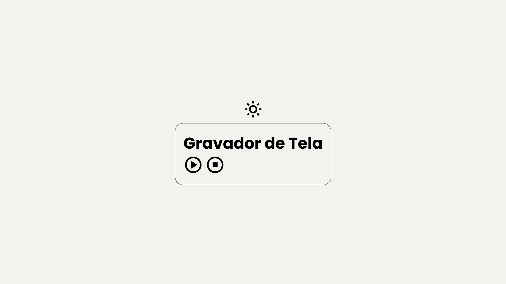
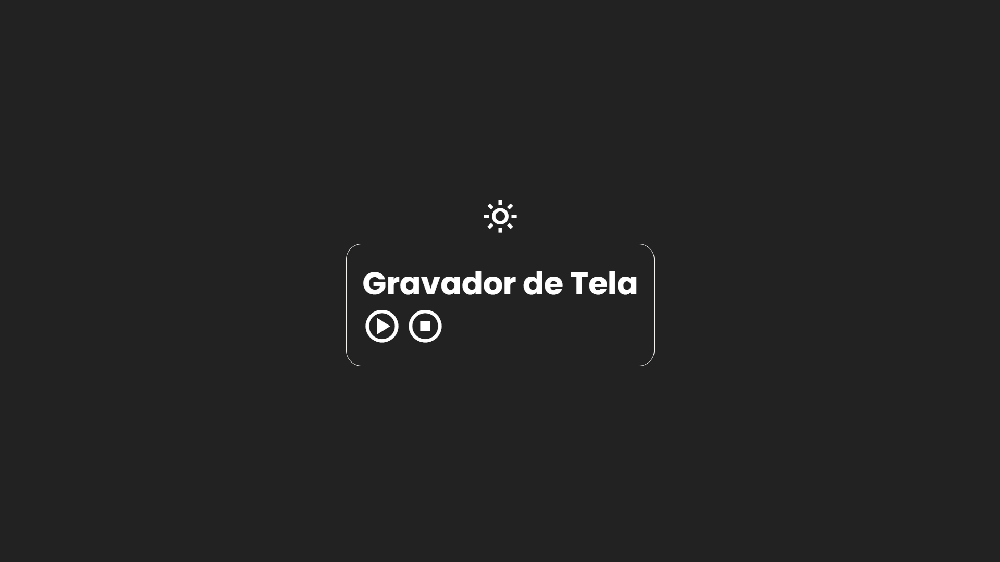

# Link Tree

Gravador-Tela é um projeto simples e funcional para gravar a tela do seu computador de maneira prática e direta. O objetivo é proporcionar uma solução intuitiva e acessível para quem precisa capturar vídeos da tela.

## Índice

- [Visão Geral](#visão-geral)
  - [Imagens](#Imagens)
- [Funcionalidades](#funcionalidades)
- [Tecnologias Utilizadas](#tecnologias-utilizadas)
- [Começando](#começando)
  - [Instalação](#instalação)
- [Contribuindo](#contribuindo)
- [Contato](#contato)

## Visão Geral

Este projeto foi desenvolvido para facilitar a gravação de tela com uma interface simples e de fácil uso. Ideal para capturar apresentações, tutoriais ou qualquer atividade na tela de maneira eficiente e rápida.

[Link Tree](https://github.com/DalioSY/gravador-tela)

## Imagens

Aqui estão algumas imagens do projeto:

<div>
    
    
</div>

## Funcionalidades

- Interface responsiva para dispositivos móveis e desktops
- Simples e direto ao ponto
- gravar, pausar e baixar.

## Tecnologias Utilizadas

- HTML
- CSS
- JavaScript

## Começando

### Instalação

1. Clone este repositório

```bash
git clone https://github.com/DalioSY/gravador-tela.git
```

2. Acesse a pasta do projeto

```bash
cd gravador-tela
```

## Contribuindo

Contribuições são bem-vindas! Se você tiver sugestões de melhorias ou encontrar algum bug, sinta-se à vontade para abrir uma issue ou submeter um pull request.

## Contato

- **Dalio Shindi Yamada**
- [GitHub](https://github.com/DalioSY)
- [LinkedIn](https://www.linkedin.com/in/dalio-s-yamada)
- [Portfólio](https://portfolio-dalio.vercel.app/)
